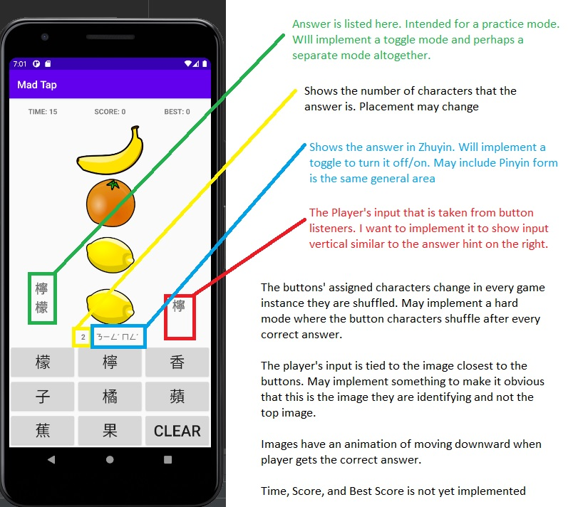

# Mad_Tap

This is a personal project made to increase my set of vocabulary for learning Mandarin. 

MANDARIN MATCH (WIP)

====================================

Choose the correct symbol that matches the upcoming picture
- divided in categories
- choose the number of words you would like to practice with

====================================

LAYOUT
- Top bar - shows time, score, high score
- Bottom bar - shows every character for available answers 3x3 buttons with bottom corner reserved for clear button
- Menu button - go back to categories, restart, or choose a different mode of the game, change settings (traditional/simplified, etc)

====================================

RULES (4 modes)
- Standard: Get as many correct answers within a time limit
- Hard: Time limit and layout of character buttons is shuffled after every correct answer
- Practice: No time limit and the answer is shown on the left side
- Endless: No time limit, but the first wrong answer will end the game

- Traditional / Simplified (Personally I would rather only learn Traditional, not a high priority to implement a simplified option)
- Characters that need more than one to mean something (ie. basketball can be represented as a basketball, but would need more than 1 character). On the interface the card with the basketball image would have a (2) underneath the image showing you need 2 characters

====================================

DATABASE (WIP to connect app to database, currently all hard coded)
- Database needs work, specifically images. Otherwise, code is easy to generate from existing excel and queries are basic
- Database will be MySQL (because I am familiar with it)

CHARACTERS
Name
Mandarin 
Symbol (Image)
Audio file (Not Necessary)
category ID

Category
================================

INTERFACE
- Button > Start
- Drop down menu > Category
- Input > # of words (WIP)
- Radio button > Traditional/Symplified
- Radio button > Audio (No audio implemented currently)
- Button > Start

======================================================================

WHAT IS IMPLEMENTED
- Basic working tapping game where there is a list of hard coded characters that are randomly put into the buttons 
- Images are all in the drawable folder, database will store the location
- Upon inputting the correct characters, a quick animation of the next image moves downward, if incorrect quick animation of the image shakes
- All 4 modes are implemented
- A random image is chosen into the list
